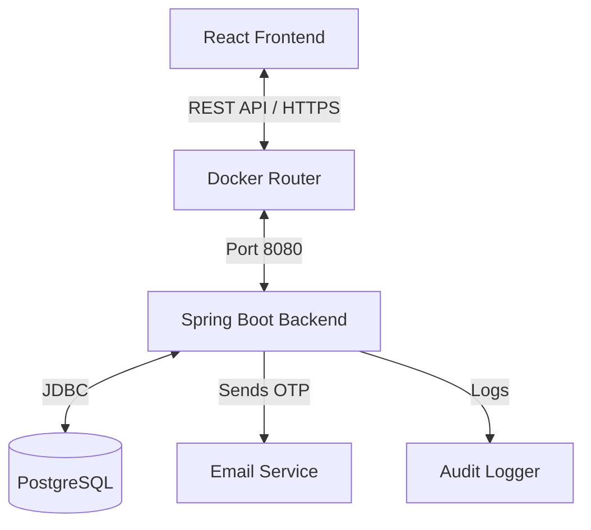

# PassKind - Technical Documentation

## Table of Contents

1. [Overview](#overview)
2. [Architecture](#architecture)
3. [Features & Modules](#features--modules)
4. [Security Model](#security-model)
5. [Getting Started](#getting-started)
6. [Development Guide](#development-guide)
7. [API Reference](#api-reference)
8. [Email Templates](#email-templates)
9. [Troubleshooting](#troubleshooting)

---

## Overview

**PassKind** is a self-hosted, full-stack password manager designed for privacy and security. It employs a "zero-knowledge" architecture where secrets are encrypted before storage.

### Tech Stack

- **Frontend**: React 18, Vite, Tailwind CSS, Framer Motion
- **State Management**: Zustand, TanStack Query
- **Backend**: Spring Boot 3.2, Java 17
- **Database**: PostgreSQL 15
- **Infrastructure**: Docker & Docker Compose
- **Authentication**: JWT (HS512), BCrypt
- **Encryption**: AES-256-GCM
- **Email**: JavaMailSender with HTML templates

---

## Architecture

### High-Level Design



### Frontend Architecture (`passkind-frontend`)

The frontend is built with a component-based architecture using React and Vite.

- **Routing**: `react-router-dom` handles client-side routing.
- **Theming**: Custom `ThemeContext` with `ocean` primary and `deep` secondary colors.
- **Animations**: `framer-motion` powers smooth transitions and modal animations.
- **Toast Notifications**: `react-hot-toast` with custom z-index for modal compatibility.
- **State**:
  - `useAuthStore` (Zustand): User session, tokens, auto-lock settings.
  - `TanStack Query`: Server state (secrets, user data, caching).

**Key Components:**

- `LandingPage.jsx`: Marketing page with interactive password generator.
- `Dashboard.jsx`: Main hub with vault health, quick access, security widgets.
- `Login.jsx`: Multi-step forgot password modal with OTP verification.
- `Profile.jsx`: User settings with change password modal.
- `VaultHealth.jsx`: Visual password strength indicator.

### Backend Architecture (`passkind-backend`)

Layered Spring Boot application:

- **Controller Layer**: REST endpoints with dual path support (`/api/...` and `/...`).
- **Service Layer**: Business logic (UserService, SecretService, OTPService, EmailService).
- **Security Layer**:
  - `JwtAuthenticationFilter`: Token validation.
  - `EncryptionService`: AES-256 encryption/decryption.
  - `SecurityConfig`: Path-based security rules.
- **Repository Layer**: JPA interfaces for database interaction.

---

## Features & Modules

### 1. Landing Page

- **Orbital Hero**: CSS/Framer Motion animations.
- **Interactive Widgets**: Embedded password generator.
- **Theme Toggle**: Light/Dark mode support.

### 2. User Dashboard

- **Vault Health**: Security score based on password complexity and age.
- **Quick Actions**: Add secrets, favorites, settings.
- **Security Tips**: Rotating security advice.
- **Recent Activity**: Audit trail of vault interactions.

### 3. Authentication & User Management

#### Registration

- Creates user with BCrypt-hashed password.
- Sends 6-digit OTP via branded email.
- Email verification required for full access.

#### Login

- Supports username, email, or phone number.
- Issues JWT (`accessToken`) valid for 1 hour.
- Account locking after 5 failed attempts (1-hour duration).

#### Forgot Password Flow

- **Step 1**: User enters email.
- **Step 2**: System sends OTP to email.
- **Step 3**: User verifies OTP.
- **Step 4**: User sets new password.
- Multi-step modal interface with proper error handling.

#### Change Password

- Accessible from profile page.
- Requires current password verification.
- Modal-based UI for clean UX.

#### Email Verification

- 6-digit OTP sent via professional HTML email.
- 5-minute expiry window.
- Resend OTP functionality.

### 4. Secret Management

- **CRUD Operations**: Create, Read, Update, Delete secrets.
- **Encryption**: AES-256-GCM encryption before database storage.
- **Metadata**: Custom key-value pairs (URL, username, notes).
- **Tagging**: Organize with custom tags.
- **Favorites**: Quick access to frequently used secrets.
- **History & Audit**:
  - **Secret History**: Previous versions with decrypted values.
  - **Audit Logs**: Detailed timeline of access and modifications.

### 5. Advanced Features

#### Auto-Lock

- Configurable inactivity timeout (1-60 minutes).
- Requires re-authentication to unlock.
- User-configurable from profile settings.

#### Import/Export

- **JSON Export**: Unencrypted backup of entire vault.
- **Excel Export**: Password-protected Excel file.
- Bulk import from CSV (with validation).

#### Password Generator

- Built-in tool for strong password creation.
- Customizable length, numbers, symbols.
- Available as widget on landing page.

---

## Security Model

### Zero-Knowledge Encryption

PassKind uses **AES-256-GCM** (Galois/Counter Mode) for encrypting secret values.

- **Key Management**: `ENCRYPTION_KEY` (32 bytes) injected via environment.
- **Process**:
  1. User submits plaintext value.
  2. Backend generates unique IV (Initialization Vector).
  3. Value encrypted using Key + IV.
  4. Ciphertext and IV stored in database.
  5. Decryption requires same Key + IV.

### JWT Authentication

- **Algorithm**: HS512 (HMAC SHA-512).
- **Stateless**: No server-side sessions.
- **Token Lifespan**: 1 hour.
- **Protection**: Tokens signed to prevent tampering.

### Account Protection

- **Failed Login Attempts**: Max 5 before 1-hour lock.
- **Password Hashing**: BCrypt with salt.
- **Auto-Lock**: Automatic logout after inactivity.

---

## Getting Started

### Prerequisites

- Docker Desktop installed and running.
- Git for cloning repository.

### Installation

1. **Clone the repo**:

   ```bash
   git clone https://github.com/gaviprasad/passkind.git
   cd passkind
   ```

2. **Configure Environment**:

   - Copy `.env.example` to `.env`.
   - Update required variables:
     - `POSTGRES_USER`, `POSTGRES_PASSWORD`, `POSTGRES_DB`
     - `JWT_SECRET` (min 32 characters)
     - `ENCRYPTION_KEY` (exactly 32 characters)
     - `MAIL_HOST`, `MAIL_PORT`, `MAIL_USERNAME`, `MAIL_PASSWORD`
     - `VITE_API_URL`

3. **Start Services**:

   ```bash
   docker-compose up -d
   ```

   _First run may take 2-3 minutes to download images._

4. **Access App**:
   - Frontend: `http://localhost:5173`
   - Backend API: `http://localhost:8080/api`
   - DB Admin (Adminer): `http://localhost:8081`

---

## Development Guide

### Project Structure

```
passkind/
├── passkind-backend/       # Spring Boot Source
│   ├── src/main/java/com/passkind/backend/
│   │   ├── controller/     # API Endpoints (dual path support)
│   │   ├── entity/         # DB Models (User, Secret, OTP, AuditLog)
│   │   ├── security/       # JWT & Encryption
│   │   ├── service/        # Logic (Email, OTP, User, Secret)
│   │   └── exception/      # Global error handlers
├── passkind-frontend/      # React Source
│   ├── src/
│   │   ├── components/     # Reusable UI (Loader, Layout, etc.)
│   │   ├── pages/          # Routes (Login, Dashboard, Profile)
│   │   ├── store/          # Zustand Stores (authStore)
│   │   └── utils/          # Helpers (api.js, errorUtils.js)
├── docker-compose.yml      # Orchestration
├── .env.example            # Environment template
└── DOCUMENTATION.md        # This file
```

### Hot Reloading

- **Frontend**: Vite HMR is active. Changes reflect instantly.
- **Backend**: Spring Boot DevTools enabled. Recompiles on save (3-5s delay).

### Common Commands

- **Rebuild Containers**: `docker-compose up --build`
- **View Logs**: `docker-compose logs -f [service-name]`
- **Stop**: `docker-compose down`
- **Reset Database**: `docker-compose down -v` (⚠️ Deletes all data)

---

## API Reference

### Authentication Endpoints

| Method | Endpoint                    | Description             | Auth |
| ------ | --------------------------- | ----------------------- | ---- |
| POST   | `/api/auth/register`        | Create new user         | ❌   |
| POST   | `/api/auth/login`           | Get JWT token           | ❌   |
| POST   | `/api/auth/verify-email`    | Verify OTP code         | ❌   |
| POST   | `/api/auth/resend-otp`      | Resend verification OTP | ❌   |
| POST   | `/api/auth/forgot-password` | Initiate password reset | ❌   |
| POST   | `/api/auth/reset-password`  | Reset password with OTP | ❌   |

### User Endpoints

| Method | Endpoint                     | Description             | Auth |
| ------ | ---------------------------- | ----------------------- | ---- |
| GET    | `/api/users/me`              | Get current user info   | ✅   |
| PUT    | `/api/users/me`              | Update user profile     | ✅   |
| POST   | `/api/users/change-password` | Change password         | ✅   |
| PUT    | `/api/users/preferences`     | Update user preferences | ✅   |

### Secret Endpoints

| Method | Endpoint                    | Description                        | Auth |
| ------ | --------------------------- | ---------------------------------- | ---- |
| GET    | `/api/secrets`              | List user's secrets                | ✅   |
| POST   | `/api/secrets`              | Create new secret                  | ✅   |
| GET    | `/api/secrets/{id}`         | Get secret details                 | ✅   |
| GET    | `/api/secrets/{id}/value`   | Get decrypted value                | ✅   |
| PUT    | `/api/secrets/{id}`         | Update secret                      | ✅   |
| DELETE | `/api/secrets/{id}`         | Delete secret                      | ✅   |
| GET    | `/api/secrets/{id}/history` | Get audit trail                    | ✅   |
| GET    | `/api/secrets/export`       | Export vault as JSON               | ✅   |
| POST   | `/api/secrets/export/excel` | Export as password-protected Excel | ✅   |

**Note**: All endpoints support both `/api/...` and `/...` paths for flexibility.

---

## Email Templates

### OTP Verification Email

PassKind sends beautifully designed HTML emails for OTP verification:

**Features:**

- **Responsive Design**: Works on all email clients.
- **PassKind Branding**: Ocean gradient header with logo.
- **Clear OTP Display**: Large, monospace font with letter spacing.
- **Security Warnings**: Highlights 5-minute expiry and no-share policy.
- **Professional Footer**: Copyright and support contact.

**Email Configuration:**

Set these environment variables in `.env`:

```env
MAIL_HOST=smtp.gmail.com
MAIL_PORT=587
MAIL_USERNAME=your_email@gmail.com
MAIL_PASSWORD=your_app_password
```

**For Gmail Users:**

1. Enable 2-Factor Authentication.
2. Generate an [App Password](https://support.google.com/accounts/answer/185833).
3. Use the App Password in `MAIL_PASSWORD`.

---

## Troubleshooting

### "Invalid AES Key Length"

**Issue**: Backend fails to start with AES key error.

**Fix**: Ensure `ENCRYPTION_KEY` is exactly 32 characters in `.env`.

### "Email Not Sending"

**Issue**: Registration succeeds but no email received.

**Fix**:

1. Check backend logs: `docker logs passkind-backend`.
2. Verify `MAIL_USERNAME` and `MAIL_PASSWORD` in `.env`.
3. For Gmail, use an **App Password**, not your login password.
4. Test SMTP connectivity: `telnet smtp.gmail.com 587`.

### "Connection Refused" (Frontend → Backend)

**Issue**: Frontend shows network errors or 404s.

**Fix**:

1. Check if backend is running: `docker ps`.
2. Verify `VITE_API_URL` in `.env` matches backend URL.
3. Check SecurityConfig allows `/auth/**` and `/users/**` paths.
4. Ensure controllers support both `/api/...` and `/...` paths.

### "No Toast Notifications"

**Issue**: Toast errors/success messages don't appear.

**Fix**:

1. Ensure `<Toaster />` component is in `App.jsx`.
2. Check z-index is set high enough (9999) in toast config.
3. Verify CSS variables `--toast-bg` and `--toast-color` are defined.

### Database Persistence

**Note**: Data is stored in `postgres_data` Docker volume.

- **Reset DB**: `docker-compose down -v` (⚠️ Deletes all data).
- **Persist Data**: `docker-compose down` (without `-v`).

### "CORS Error"

**Issue**: Frontend can't connect to backend due to CORS.

**Fix**:

1. Add frontend URL to `CORS_ALLOWED_ORIGINS` in `.env`.
2. Restart backend: `docker-compose restart backend`.

---

## Deployment Guide - Render

### 🚀 Overview

- **Development**: `main` branch.
- **Production**: `production` branch.
- **Blueprint**: Uses `render.yaml` for automatic setup.

### 🛠️ Initial Setup

1. **Create Production Branch**:

   ```bash
   git checkout -b production
   git push -u origin production
   ```

2. **Connect to Render**:

   - Go to [dashboard.render.com](https://dashboard.render.com).
   - Click **New +** → **Blueprint**.
   - Connect GitHub repository.
   - Select `production` branch.

3. **Configure Environment Variables**:

   Set these in Render Dashboard:

   - `SPRING_DATASOURCE_URL`: Neon DB URL
   - `SPRING_DATASOURCE_USERNAME`: DB username
   - `SPRING_DATASOURCE_PASSWORD`: DB password
   - `ENCRYPTION_KEY`: 32-character string
   - `JWT_SECRET`: 64+ character string
   - `CORS_ALLOWED_ORIGINS`: Frontend URL
   - `VITE_API_URL`: Backend URL (after first deploy)
   - `MAIL_USERNAME` / `MAIL_PASSWORD`: Email credentials

4. **Deploy**:
   - Click **Apply**.
   - Render creates backend (Docker) and frontend (Static Site).

### 🔄 Deployment Workflow

When ready to deploy from `main`:

```bash
git checkout production
git merge main
git push origin production
```

Render auto-deploys on push to `production`.

### ⚠️ Troubleshooting

- **Frontend can't reach Backend**: Verify `VITE_API_URL` in frontend settings.
- **Database Errors**: Check `SPRING_DATASOURCE_URL` includes `?sslmode=require`.
- **Build Failures**: Check logs in Render Dashboard.

---

<p align="center">
  <strong>PassKind</strong> - Your Digital Life, Secured<br>
  Made with ❤️ by <a href="https://github.com/gaviprasad">Gavi Prasad</a>
</p>
