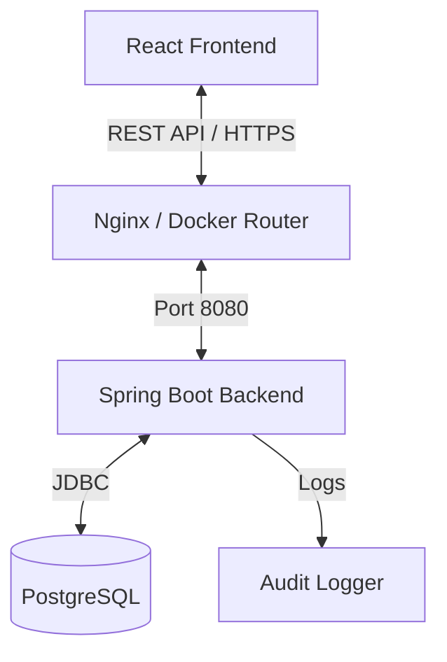

# passKind - Technical Documentation

## Table of Contents

1. [Overview](#overview)
2. [Architecture](#architecture)
3. [Features & Modules](#features--modules)
4. [Security Model](#security-model)
5. [Getting Started](#getting-started)
6. [Development Guide](#development-guide)
7. [API Reference](#api-reference)
8. [Troubleshooting](#troubleshooting)

---

## Overview

**passKind** is a self-hosted, full-stack password manager designed for privacy and security. It employs a "zero-knowledge" architecture where possible, ensuring that secrets are encrypted before storage.

### Tech Stack

- **Frontend**: React 18, Vite, Tailwind CSS, Framer Motion
- **State Management**: Zustand, TanStack Query
- **Backend**: Spring Boot 3.2.3, Java 17
- **Database**: PostgreSQL 15
- **Infrastructure**: Docker & Docker Compose
- **Authentication**: JWT (HS512), BCrypt
- **Encryption**: AES-256-GCM

---

## Architecture

### High-Level Design



### Frontend Architecture (`passkind-frontend`)

The frontend is built with a component-based architecture using React and Vite.

- **Routing**: `react-router-dom` handles client-side routing.
- **Theming**: A custom `ThemeProvider` (via `index.css` variables and Tailwind `dark` mode) manages Light/Dark themes.
- **Animations**: `framer-motion` powers complex animations (Landing Page hero, staggered entrances, 3D cards).
- **State**:
  - `useAuthStore` (Zustand): Manages user session, tokens, and preferences.
  - `TanStack Query`: Handles server state (fetching secrets, caching, invalidation).

**Key Components:**

- `LandingPage.jsx`: A high-performance marketing page with interactive widgets (Password Generator) and 3D visualizations.
- `Dashboard.jsx`: The main user hub featuring Vault Health, Quick Access, and Security Widgets.
- `VaultHealth.jsx`: Visualizes password strength and hygiene using a circular score indicator.
- `PasswordGeneratorWidget.jsx`: A standalone, interactive widget for generating secure strings.

### Backend Architecture (`passkind-backend`)

The backend is a layered Spring Boot application.

- **Controller Layer**: REST endpoints (`AuthController`, `SecretController`, `UserController`).
- **Service Layer**: Business logic and transaction management.
- **Security Layer**:
  - `JwtAuthenticationFilter`: Intercepts requests to validate JWT tokens.
  - `EncryptionService`: Handles AES-256 encryption/decryption of secret values.
- **Repository Layer**: JPA interfaces for database interaction.

---

## Features & Modules

### 1. Landing Page

A fully responsive, animated landing page designed to convert visitors.

- **Orbital Hero**: Custom canvas-like animation using CSS/Framer Motion.
- **Interactive Widgets**: Embedded `PasswordGeneratorWidget` lets users try features instantly.
- **Theme Toggle**: Seamless switching between "Vault Dark" and "Clean Light" modes.

### 2. User Dashboard

The central command center for users.

- **Vault Health**: Calculates a security score based on password age, reuse, and complexity.
- **Quick Actions**: One-click access to add secrets, view favorites, or update settings.
- **Security Tips**: "Did You Know?" widget providing rotating security advice.
- **Recent Activity**: Audit trail of the latest vault interactions.

### 3. Authentication & User Management

- **Registration**: Creates a new user with hashed password.
- **Login**: Issues a JWT (`accessToken`) valid for 1 hour.
- **Email Verification**:
  - Users receive a 6-digit OTP via email upon registration.
  - Verification is required to unlock full account features (like password recovery).
  - Configurable via SMTP settings in `docker-compose.yml`.
- **Profile Management**: Users can update usernames and preferences. Token is automatically refreshed upon username change.

### 4. Secret Management

- **CRUD Operations**: Create, Read, Update, Delete secrets.
- **Encryption**: Values are encrypted _before_ saving to the database.
- **Metadata**: Support for custom key-value pairs (e.g., website URL, username).
- **Tagging**: Organize secrets with custom tags.
- **Favorites**: Mark frequently used secrets for quick access via the "Favorites" tab.
- **History & Audit**:
  - **Secret History**: View previous versions of a secret (if enabled).
  - **Audit Logs**: Detailed timeline of who accessed or modified a secret and when.

### 5. Advanced Features

- **Auto-Lock**:
  - Automatically locks the vault after a user-defined period of inactivity (default: 15 mins).
  - Requires re-authentication (password) to unlock.
  - Configurable in User Settings.
- **Import/Export**:
  - **Export**: Download your entire vault as a CSV file for backup.
  - **Import**: Bulk import secrets from CSV (schema validation included).
- **Password Generator**:
  - Built-in tool to create strong, random passwords.
  - Customizable length, numbers, and symbols.

---

## Security Model

### Zero-Knowledge Encryption

PassKind uses **AES-256-GCM** (Galois/Counter Mode) for encrypting secret values.

- **Key Management**: The `ENCRYPTION_KEY` (32 bytes) is injected via environment variables.
- **Process**:
  1. User submits plaintext value.
  2. Backend generates a unique IV (Initialization Vector).
  3. Value is encrypted using the Key + IV.
  4. Ciphertext and IV are stored in the database.
  5. Decryption requires the same Key + IV.

### JWT Authentication

- **Algorithm**: HS512 (HMAC SHA-512).
- **Stateless**: No server-side sessions.
- **Protection**: Tokens are signed to prevent tampering.

---

## Getting Started

### Prerequisites

- Docker Desktop installed.

### Installation

1. **Clone the repo**:
   ```bash
   git clone https://github.com/yourusername/passkind.git
   cd passkind
   ```
2. **Configure Environment**:

   - Open `docker-compose.yml`.
   - Update `MAIL_USERNAME` and `MAIL_PASSWORD` (App Password) for email features.
   - (Optional) Change `ENCRYPTION_KEY` and `JWT_SECRET` for production.

3. **Start Services**:

   ```bash
   docker-compose up -d
   ```

   _First run may take 2-3 minutes to download images._

4. **Access App**:
   - Frontend: `http://localhost:3000`
   - Swagger API: `http://localhost:8080/swagger-ui.html`

---

## Development Guide

### Project Structure

```
passkind/
├── passkind-backend/       # Spring Boot Source
│   ├── src/main/java/com/passkind/backend/
│   │   ├── controller/     # API Endpoints
│   │   ├── entity/         # DB Models
│   │   ├── security/       # JWT & Encryption
│   │   └── service/        # Logic (Email, OTP, Secrets)
├── passkind-frontend/      # React Source
│   ├── src/
│   │   ├── components/     # Reusable UI (Widgets, Cards)
│   │   ├── pages/          # Routes (Landing, Dashboard, VerifyEmail)
│   │   └── store/          # Zustand Stores
├── docker-compose.yml      # Orchestration
└── DOCUMENTATION.md        # This file
```

### Hot Reloading

- **Frontend**: Vite HMR is active. Edits to `.jsx` files reflect instantly.
- **Backend**: Spring Boot DevTools is active. Recompiles on file save (3-5s delay).

### Common Commands

- **Rebuild Containers**: `docker-compose up --build`
- **View Logs**: `docker-compose logs -f`
- **Stop**: `docker-compose down`

---

## API Reference

### Auth

- `POST /auth/register`: Create account.
- `POST /auth/login`: Get JWT token.
- `POST /auth/verify-email`: Verify OTP code.
- `POST /auth/resend-otp`: Resend verification email.

### Secrets

- `GET /api/secrets`: List all secrets (metadata only).
- `POST /api/secrets`: Create new secret.
- `GET /api/secrets/{id}`: Get secret details.
- `GET /api/secrets/{id}/value`: Get **decrypted** value.
- `GET /api/secrets/{id}/history`: Get audit trail for a secret.

### Users

- `PUT /api/users/profile`: Update profile.
- `GET /api/users/export`: Download vault as CSV.

---

## Troubleshooting

### "Invalid AES Key Length"

**Issue**: The backend fails to start with `Invalid AES key length`.
**Fix**: Ensure `ENCRYPTION_KEY` in `docker-compose.yml` is exactly 32 bytes.

### "Email Not Sending"

**Issue**: Registration succeeds but no email is received.
**Fix**:

1. Check backend logs: `docker logs passkind-backend`.
2. Verify `MAIL_USERNAME` and `MAIL_PASSWORD` in `docker-compose.yml`.
3. Ensure you are using an **App Password** (not login password) for Gmail.

### "Connection Refused" (Frontend -> Backend)

**Issue**: Frontend shows network errors.
**Fix**:

1. Check if backend is running: `docker ps`.
2. Verify `VITE_API_URL` in `docker-compose.yml` matches the backend service URL.

### Database Persistence

**Note**: Data is stored in the `postgres_data` Docker volume.

- To **reset** the DB: `docker-compose down -v` (Warning: Deletes all data).
- To **persist** data: `docker-compose down` (without `-v`).


=======================================================================================================================


# Deployment Guide - Render

This guide explains how to deploy PassKind to Render using a conflict-free `production` branch workflow.

## 🚀 Overview

- **Development**: Happens on the `main` branch.
- **Production**: Happens on the `production` branch.
- **Conflict-Free**: Configuration files (`render.yaml`, `Dockerfile.prod`) exist in both branches, so merging `main` -> `production` never causes conflicts.

---

## 1. Initial Setup

### Step 1: Create Production Branch

Run these commands in your terminal:

```bash
# Ensure you are on main and up to date
git checkout main
git pull origin main

# Create production branch
git checkout -b production

# Push to GitHub
git push -u origin production
```

### Step 2: Connect to Render

1. Go to [dashboard.render.com](https://dashboard.render.com).
2. Click **New +** -> **Blueprint**.
3. Connect your GitHub repository.
4. Give Render permission to access your repo if needed.

### Step 3: Configure Blueprint

Render will automatically detect the `render.yaml` file.

1. **Service Group Name**: Enter `passkind-production`.
2. **Branch**: Select `production`.
3. **Environment Variables**: You will be prompted to enter the values we defined in `render.yaml`.

   - `SPRING_DATASOURCE_URL`: Your Neon DB URL (e.g., `jdbc:postgresql://ep-xyz.aws.neon.tech/neondb...`)
   - `SPRING_DATASOURCE_USERNAME`: Your Neon DB User
   - `SPRING_DATASOURCE_PASSWORD`: Your Neon DB Password
   - `ENCRYPTION_KEY`: A random 32-character string (generate one!)
   - `MAIL_USERNAME` / `MAIL_PASSWORD`: Your Gmail credentials (optional)

4. Click **Apply**.

Render will now build and deploy your application! 🚀

---

## 2. Deployment Workflow

When you have finished developing a feature on `main` and want to release it:

1. **Switch to Production**:

   ```bash
   git checkout production
   ```

2. **Merge Main**:

   ```bash
   git merge main
   ```

   _Since config files exist in both branches, this will be a clean merge._

3. **Push to Deploy**:
   ```bash
   git push origin production
   ```

Render detects the push to `production` and automatically redeploys.

---

## 3. Troubleshooting

### Build Failures

- **Backend**: Check the logs. Ensure `Dockerfile.prod` is being used (Render should auto-detect this from `render.yaml`).
- **Frontend**: Ensure `VITE_API_URL` is correctly set. In the Render Dashboard, check the frontend service's "Environment" tab. It should show `VITE_API_URL` linked to the backend service.

### Database Connection

- Ensure your Neon DB allows connections from anywhere (0.0.0.0/0) or whitelists Render's IP addresses.
- Verify the JDBC URL format: `jdbc:postgresql://<host>:5432/<database>?sslmode=require`

### "Invalid AES Key Length"

- The `ENCRYPTION_KEY` must be **exactly 32 bytes**. If you generated a random string, make sure it's 32 chars long.
